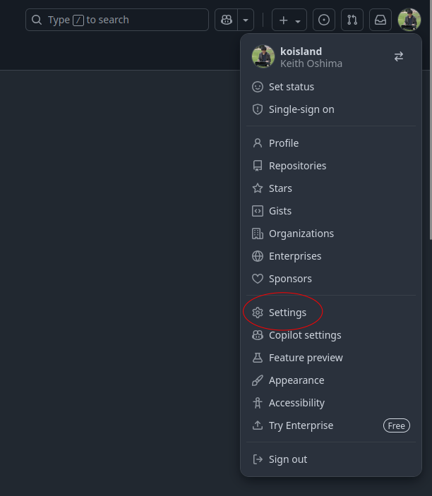
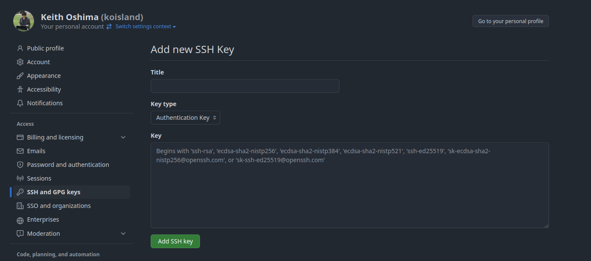
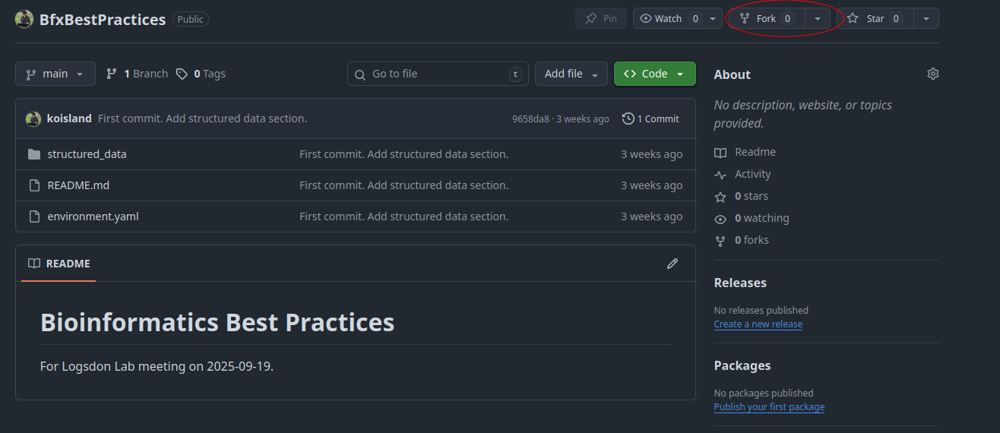

# Getting started

## LPC access
Make sure you have LPC access. We'll use pepe as our host node.
```bash
# Your PMACS username.
USER=""
ssh $USER@pepe.pmacs.upenn.edu
```

## Conda
[Install conda](https://github.com/conda-forge/miniforge?tab=readme-ov-file#unix-like-platforms-macos-linux--wsl) on the cluster.
* If you have already installed conda, you can skip this step.
```bash
wget "https://github.com/conda-forge/miniforge/releases/latest/download/Miniforge3-$(uname)-$(uname -m).sh"
bash Miniforge3-$(uname)-$(uname -m).sh
# Then type 'Y' to the prompts.
```

Exit your terminal and log back onto pepe. It should now look something like this:
```
(base) [koisland@pepe ~]$ 
```

Now install the environment for the workshop.
```bash
conda env create -f environment.yaml --name workshop
conda activate workshop
```

## GitHub account and SSH key
First, create a GitHub account.


After creating a GitHub account. We'll [create an SSH key](https://docs.github.com/en/authentication/connecting-to-github-with-ssh/generating-a-new-ssh-key-and-adding-it-to-the-ssh-agent#generating-a-new-ssh-key) on the LPC to allow writing to our account without writing our password everytime.
* If one already exists, you can skip this step.
* You can skip the password.

```bash
ssh-keygen -t rsa -C "user@email.com"
```

Go to your GitHub setttings.

Copy the contents of `~/.ssh/id_rsa.pub` and [add it as an authentication key](https://docs.github.com/en/authentication/connecting-to-github-with-ssh/adding-a-new-ssh-key-to-your-github-account#adding-a-new-ssh-key-to-your-account).
```bash
less ~/.ssh/id_rsa.pub
# Highlight and copy to your clipboard.
```



## Forking this repo.
Finally, we'll fork this repo. After that


Once your version is forked, clone your repo via SSH.
```bash
GH_USER=""
git clone git@github.com:$GH_USER/BfxBestPractices.git
```
