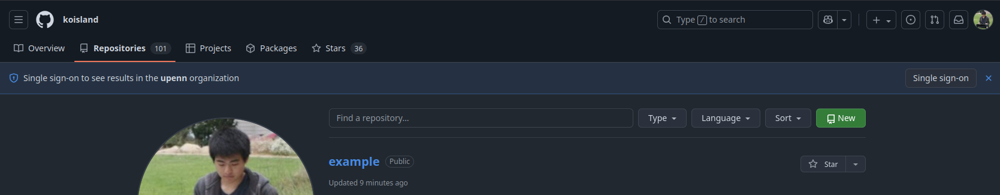
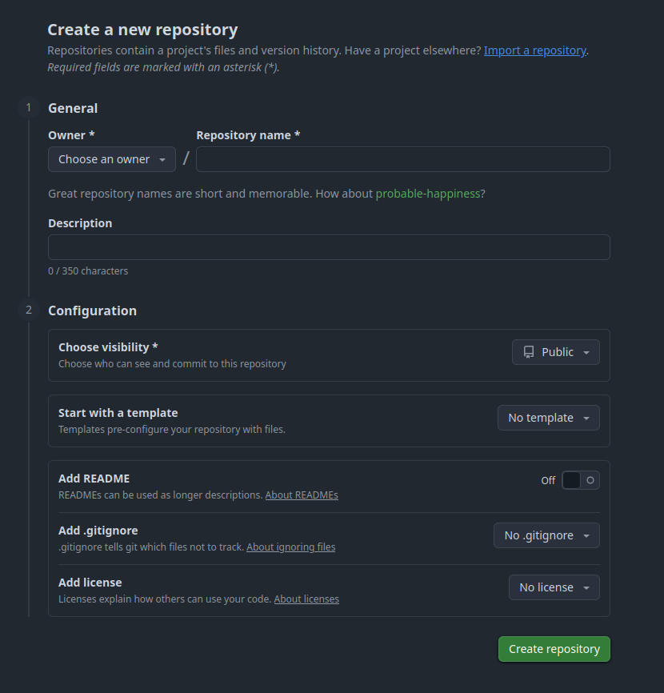
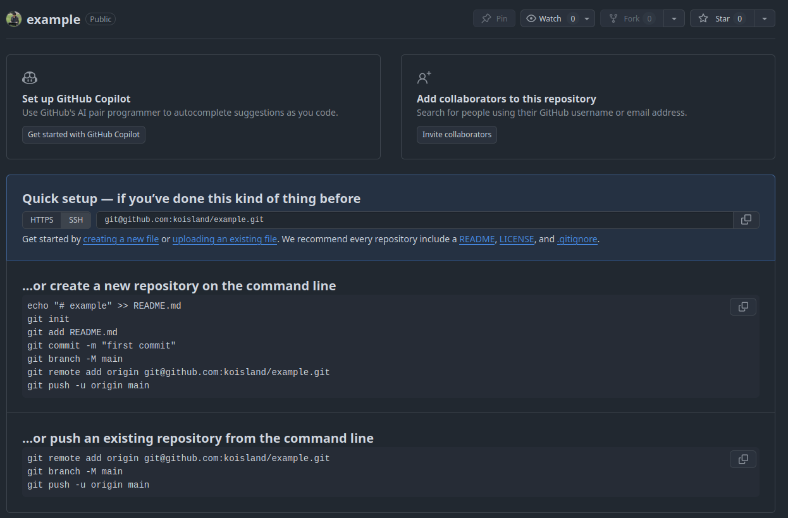
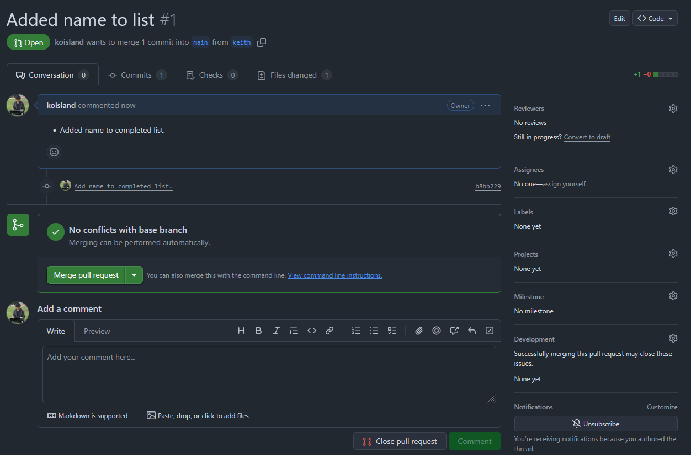
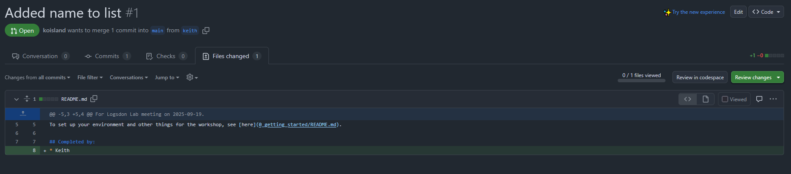

# Using git and GitHub
Git and github allow easy sharing of code with others in research.

## git
Is a command-line tool used for software versioning. It operates on folders (Called repositiories) and stores file information in the hidden `.git` folder. 
* Repositories can be local (On my computer) or remote (On GitHub)
  * In [`0_getting_started`](../0_getting_started/README.md), we forked and cloned an existing remote repository.

### Making a repo
Here, we'll make a local repository as an example.
```bash
mkdir -p example
pushd example
```

We initialize the repo with `git init`. This will have it's own versioning history.
```bash
git init
ls -lah
```

### Making changes
Let's add a `README.md`.
```bash
printf "# Hello World\nThis is an example.\n" > README.md
```

We'll ask git to store these changes.
```bash
git add README.md
```

### Storing changes
And make a commit to finalize our changes. It's good to have a useful message associated with the changes.
```bash
git commit -m "First commit."
```

### Creating a remote repository on GitHub and updating it
We need to create a remote repository to store our local changes.

From your "Repositories" tab, you can click "New".



Give it a name and description.



And for the quick setup, we're going to follow the bottom set of instructions.



```bash
git remote add origin git@github.com:koisland/example.git
git branch -M main
git push -u origin main
```

You can now check your remote branch. The changes your made should be visible.

## Using git collaboratively
Now we'll take a look at using Git collaboratively. Exit this repo before we begin.
```
popd
```

### Branches
Changes in a repo are represented as branches in a tree. Multiple branches can be made from the main branch.
* Other branches could be work from a collaborator, contributor, etc.

</img>

> Here the `master` branch on `My Computer` has changes diverged from `origin/master` `git.outcompany.com`. These need to resolved before merging.

Make a new branch within this repository your name.
```bash
git checkout -b $USER
```

### Checking changes
`git` can tell you what changes you have done in this branch since a previous commit.

The status of the repo.
```bash
git status
```

```
On branch main
Your branch is up to date with 'origin/main'.

Changes to be committed:
  (use "git restore --staged <file>..." to unstage)
        new file:   0_getting_started/README.md
        new file:   0_getting_started/images/github.png
        new file:   0_getting_started/images/ssh_key.png
        new file:   0_getting_started/images/user_settings.png
        new file:   1_using_git_and_github/README.md
        new file:   1_using_git_and_github/docs/git_branches.png
        modified:   README.md

Changes not staged for commit:
  (use "git add <file>..." to update what will be committed)
  (use "git restore <file>..." to discard changes in working directory)
        modified:   0_getting_started/README.md
        modified:   1_using_git_and_github/README.md
        modified:   README.md

Untracked files:
  (use "git add <file>..." to include in what will be committed)
        0_getting_started/images/fork.png
```
> My `git status` output as I'm writing this.

Let's add your name to the `README.md` as an exercise.

Using nano, vim, or whatever text editor you'd like, add your name under the __Completed by__ section.
```bash
nano README.md
# vim README.md
```

### Updating our fork
Now that those changes have been made, we can commit them to your branch.
```bash
git add README.md
git commit -m "Added my name to README."
```

After commiting your changes, you can push your local branch to your remote.
```bash
git push -u origin $USER
```

### Pull request
Finally, we'll open a pull-request (PR) on GitHub to merge those changes into the main branch.




> ![NOTE]
> If we overwrote someone else's contributions, we may have merge conflicts. These will need to be resolved in order to merge our changes.

Congrats! What you've just done is the core workflow of open-source software development!

In short, we've:
* Created a fork of an existing repository.
* Created a new branch.
* Made some changes.
* Opened a pull-request to merge our changes.
    * Typically, you should open an issue addressing the issue/improvement you hope to fix/implement before you do this.
